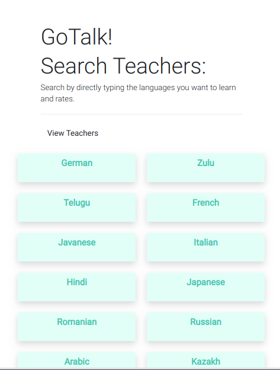
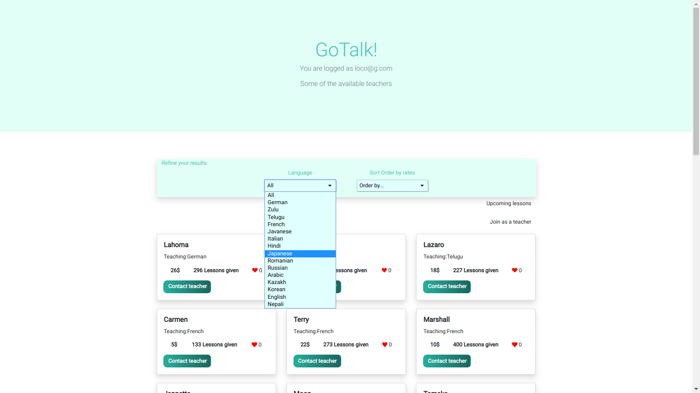

  <h3 align="center">GoTalk</h3>


  


  <p align="center">
    Ruby on Rails & React Project
    <br />
    <br />
    <a href="">View Demo</a>
    ·
    <a href="">Report Bug</a>
    ·
    <a href="">Request Feature</a>
  </p>
</p>


<!-- TABLE OF CONTENTS -->
## Table of Contents

* [About the Project](#about-the-project)
  * [Built With](#built-with)
  * [Deployment](#Deployment)
* [Contact](#Contact)


    

<!-- ABOUT THE PROJECT -->
## About The Project
This in an application to book classes with language tutors. 

### Deployment

Clone the respository and run the following commands to run a local server.

```
bundle install
rails db:migrate
rails db:seed
rails s
```

### Built With
* [Ruby on Rails](https://rubyonrails.org/)
* [React](https://reactjs.org/)
* [Redux](https://redux.js.org/introduction/getting-started)

### Contact
* [Samuel García Companys](https://github.com/samgaco) - samuelgarciacompanys@gmail.com - [Linkedin](https://www.linkedin.com/in/samuel-garc%C3%ADa-companys-0a848284/)

